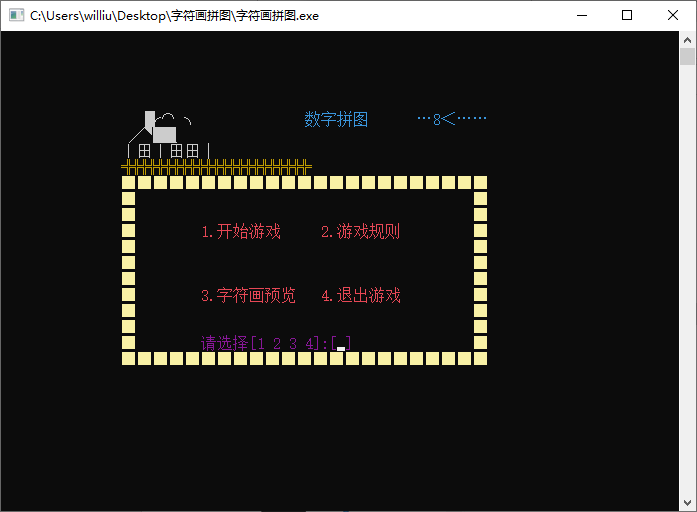
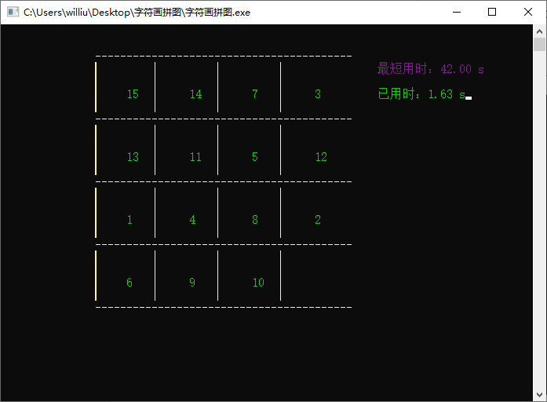
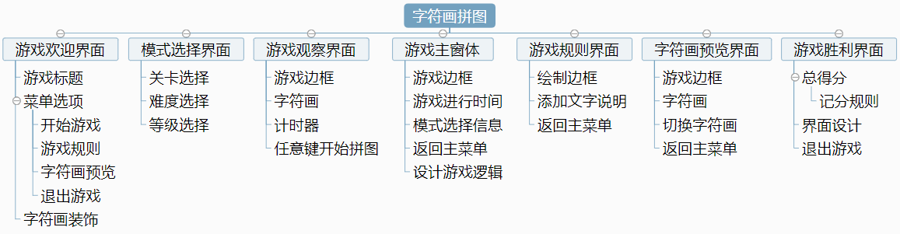
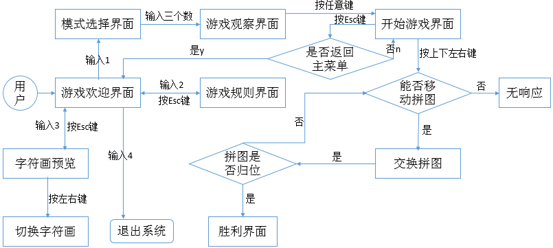

# 字符画拼图（半完成）

 

## 1开发背景

字符画拼图起源于数字拼图，数字拼图曾作为最强大脑比赛项目而被人熟知，游戏要求八个数字，九宫格，打乱之后把它们按顺序重新排好，考验选手的推理力和手指灵活性。本次开发将游戏移植到控制台窗口，保持玩法不变但将数字替换为字符画，玩家在预先观察字符画后需要将打乱的九个字符画重新排序，这就在考验推理能力的同时考验了记忆能力。

本次开发使用Dev C++，游戏开发细节如图1所示。

 

图1 字符画拼图游戏的开发细节

 

## 2系统功能设计

**2.1 ****系统功能结构**

  字符画拼图共分为7个界面，具体功能如图2所示。

图2 系统功能结构

 

**2.2****系统业务流程**

  字符画拼图的业务流程如图3所示。

 

图3 业务流程图

 

**开发特色：**

1. 利用多进程实现了毫秒、动态计时的功能，最佳纪录自动存入文件。

2. 移动空白块只交换对应数字，避免多次刷新界面，耗费资源。

   

**遇到的问题及解决过程：**

**1.** **随机，怎样使1-15随机排列？**

首先建立一个一维数组b[15]，先把此数组打乱，再赋值给Box[4][4]，但要注意避免无解的情况，因此查看打乱后排列的逆序数，如果逆序数为偶就有解；为奇就把最后两个数交换位置。

**2.** **怎么使时钟动态显示？**

新建一个进程，在主程序运行时开始，再创建一个事件，让信号为真时，进程运行，为假时暂停。重复在一个坐标位置不断刷新时间，以实现动态显示。

**3.** **子进程输出的时间显示在主进程的拼图上，怎么办？**

由于两个进程共用一个光标，难免会光标调整不过来。解决办法，在输入方向键后和交换操作前设置一个ResetEvent(hEvent);即给子进程传入一个假信号使进程停止，并且，并且，并且还要给子进程一个短暂的缓冲时间Sleep（1）；目的是让子进程走完达到真正的停止，事实上后台的时间仍在运行，只是时间短暂到肉眼观察不到其实子进程已经停止了。交换结束后SetEvent(hEvent);让子进程继续运行。

**4.** **玩完一把重新开始游戏时，显示两个时间同时运行？**

可能是又建立一个进程。所以本程序把建立进程放入到主函数中，即便重新开始的游戏，也是重复利用的上一个进程，而没有删除进程。数字随机排列完开始进程，输入方向键瞬间暂停进程，最后游戏结束暂停进程。由于时间显示是从进入游戏界面到当前的时间，所以进程里的内容不必初始化，进入画面自然重新计时。

 

**新版本想实现的功能：**

1. 字符画循环刷新动态显示。

2. 增加难度设置，把数字拼图改为字符画拼图。